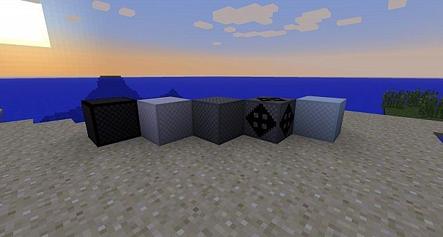

# Bouncing Blocks Mod
##### This mod currently adds 5 new blocks to the game, the Bouncing Block, Padding Block, Launcher Block, Speed Block, and the Cannon Block. This allows for more possibilities in your Minecraft world! The blocks can be easily avoided by walking on the edges, but can also be covered by carpets if you want to make a trap!
### License

*Click link for license details.*

---------------
## Table of Contents:
* [Installation](#installation)
* [Usage](#usage)
* [Credits](#credits)
* [Contribution Guidelines](#contribution-guidelines)
* [Questions](#questions)
---------------
## Installation:
1. Download the .zip. 2. Navigate to your .minecraft folder. 3. Open the mods folder. 4. Place the .zip in the mods folder. 5. Enjoy
## Usage
Adds functionality to the game of Minecraft.

## Credits
[Giamo Lao](https://www.github.com/technicalparadox)
[Przemek Jagielski](https://github.com/Gim949)
## Contribution Guidelines
[The Contributor Covenant](https://www.contributor-covenant.org/)
## Questions
Any questions should be directed to 

[Giamo Lao](https://technicalparadox.github.io)

[giamolao98@gmail.com](mailto:https://technicalparadox.github.io)
